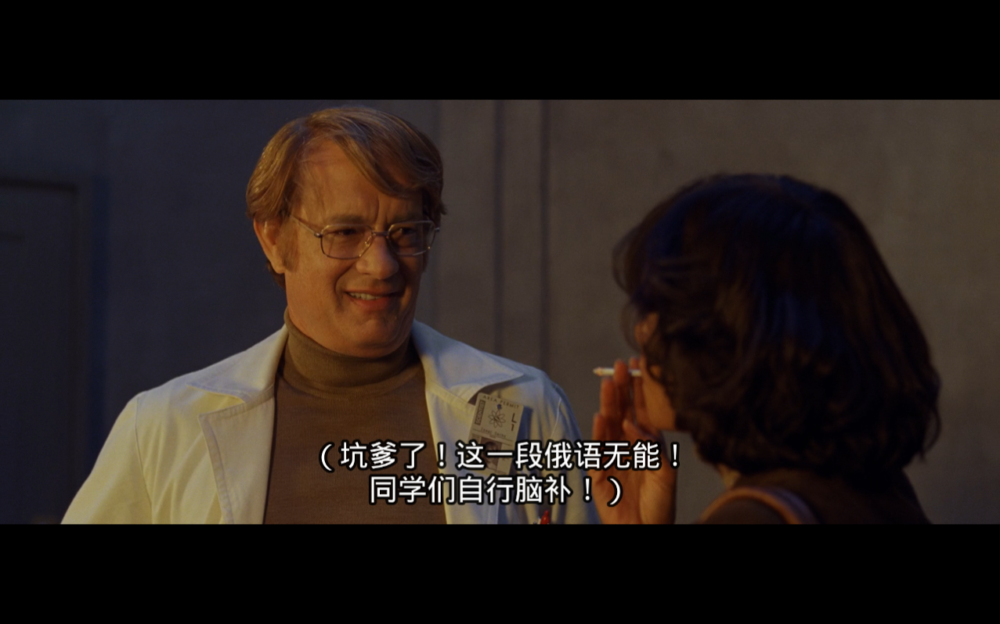

这个礼拜感觉过的挺长的，不知道哪儿来的这种感觉，反正感觉挺长的。

可能是因为前两天身体不太舒服吧。说来也奇怪，前两天突然感觉后背中间的脊柱特别痛，尤其是上半身左右转的时候特别明显，抱着怕死的心态，礼拜四那天还是去朝阳医院检查了一下。到了之后照了两张相，医生看了看骨头没啥问题，走的时候拿了两盒药，来回折腾了我多半天时间。其实如果刨去排队时间整个过程不超过四十分钟，竟花了我三百大洋，真 ™ 是抢劫啊 (￣▽￣)！贫下中农看个病容易吗？

这个礼拜开始做东西了，貌似嚷嚷了好久了，老实说一直都没付诸于行动，受过年影响拖延了好久。前两天在自己的 VPS 上建立了 Git 仓库，用 XCode 自带的 Git 版本管理功能直接推送到 VPS 上。后来从 Jay 同学那了解到 [bitbucket](http://bitbucket.org/) 可以建立私有工程，并强烈推荐了 SourceTree 代码管理工具。想了想，干脆建立两个库吧。一方面放到 bitbucket 上可以保证代码不会丢失，另一方面当初选择直接放到自己的 VPS 上其实是想更直接的学习一下 Git，毕竟自己真正动手做过之后学到的知识印象更深刻，而且还可以对 XCode 自带的 Git 管理工具有一个了解。

iOS 学习方面现阶段没啥好说的，很多不明白的地方基本上文档写的都比较明白，关键还是看你能不能踏下心来硬着头皮啃英语了。英语不好的同学桑不起啊！

另外，这里需要特别感谢一位网友，指出了很多 Box2d 教程中翻译错误或不恰当的地方，在此表示感谢，也希望大家如果发现觉得翻译不清晰或错误的地方不吝指出，我会积极改正，目的只是希望能够让更多的朋友更好的学习。

关于 Box2d，如果有空的话，我也想在页面上用 Box2dweb 尝试学习做点小 demo，供娱乐。不过感觉现在时间有限，不知道能不能挤出时间，毕竟过年将近一个月的时间基本上就没干什么正经事儿，也没写什么代码，说实话手都有点生了，感觉几天不写代码好像就不会写了似的，可能还是写的少的原因吧。打字这项运动感觉也和体育锻炼一样，长时间手指头不活动，感觉手指关节就不灵活了。

另外，小改了一下博客右边的简介，添加了我在 Twitter 上截至到上个月的时候发的所有 tweets。那些页面文件放到了我的 VPS 上，所以墙内的朋友应该也可以打开。当然内容只是截至到上个月中旬的，之后发布的内容是没有的。去除了之前右下方的 Twitter 帐户模块，现在墙内的朋友刷新页面应该会清爽很多，标签页上不会长时间有更新状态提示了。Tweets 下面添加了我的 gmail 邮箱，为了防止接收垃圾邮件，放了一张图片。平时不用 QQ，有用 gtalk 的朋友，可以加我，平时可以线上 YY。在页面的右下方保留了 Google plus，因为这只是一个连接，没有加载 Google plus 相关的内容，所以页面刷新不受影响，所以用 Google plus 的朋友还是可以互圈一下滴！

坚持每个星期至少写一篇日志不到两个月的时间，码点儿字感觉不是一件特别难的事情。记得当初上中小学的时候，记忆中是每个礼拜四有两节作文课，作文课上要求写一篇作文，下课交给语文老师。总感觉那个时候码点儿字跟要了亲命似的，每次都是第二节课才开始写，有时候写了个开头又觉得不对，撕了又重写，很多次貌似都是还有 30 分钟要下课的时候，突然有一种壮士一去不复返的悲壮感，然后按照老师出的题目，梦幻般的挤出差不多 400 个字。记忆最深刻的是，差不多如果哪次提前个十分二十分钟写完了，总要数一数写了多少字，如果写的不够，还得硬着头皮，啰里八嗦的胡乱加上几句无关痛痒的话，直到凑够 400 个字为止。有时候神奇般的写了 420 个字，还会有一种胜利的喜悦感，至于作文的质量，那是全然不顾的，总觉得那应该是老师应该操心的事情。

哦，对了，这个礼拜看了三部电影。当然是孤独的一个人窝在电脑前看的。一部是《[Life of Pi](http://movie.douban.com/subject/1929463/)》，另一部是《[人再囧途之泰囧](http://movie.douban.com/subject/10574622/)》，还有一部是《[云图](http://movie.douban.com/subject/3530403/)》。除了《人再囧途之泰囧》没什么深度以外，其余两部片子对人性的揭露还是很耐人寻味的，感觉都没怎么看懂，尤其是《云图》，也不能全怪我，找了一个坑爹的翻译字幕，

 

害的我看的迷迷糊糊的，这能全怪我吗？以后有时间了必须还得再看一遍。        
