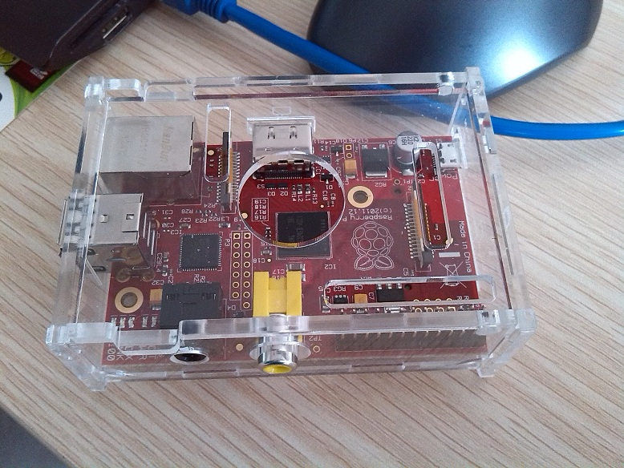

感觉本周发生了好多事情。先说说关于我的吧。

本周二的时候听了一期 [Teahour](https://teahour.fm/) 的 Podcast，节目最后的时候听人介绍了一件好玩的东西，名字叫 [Raspberry Pi](https://www.raspberrypi.org)，中文名叫<code>树莓派</code>，是一台小型计算机，还算便宜吧，两百多块钱。网上了解之后，忍不住下午就在淘宝上订了一台。



大概礼拜四的时候收到了货，然后折腾了两天。对于这个小玩意，真的好喜欢。Raspberry Pi 的操作系统是基于 Debian 的，正好可以学习用，而且 [系统以及相关工具](https://github.com/raspberrypi) 在 GitHub 上也是开源的。所以拿到手之后立刻就在上面设置了 SSH，然后搭建了 Ruby 的开发环境，然后装上了 Git。后来才发现系统自带了 Python。不过无所谓啦，我还是想学 Ruby 滴。当然啦，既然装了 Ruby，自然少不了 Rails。装完之后创建了一个应用，还在上面跑了一下，通过局域网访问了一下，速度还是不错滴，哈哈。

除了搭建 Ruby 的开发环境以外，安装了 Apache ，至于为什么不安装当前火爆的 Nginx。我觉得有两点原因吧。第一点是因为我 VPS 上装的就是 Apache ，考虑用 Raspberry Pi 当我的测试机用。第二点我觉得，虽然都说 Nginx 的性能比 Apache 好，我觉得还是先从原理上学习一下吧，具体使用上应该不会差太多，而且我觉得很多都是心理问题。在 Nginx 还没出来之前，很多大网站不都是 Apache 么？所以说都是炒作惹得祸。当然了，我并不是不肯接受新事物。我是认为作为学习，其实都差不多，原理搞明白了，剩下的都好办。

因为 Pi 自身没有显示器，所以为其安装了 [VNC](https://realvnc.com/)。如果哪次想通过图形界面访问 Pi，先在 Pi 上起一个 VNC 的 Server，然后直接在 Mac 上通过 VNC 进行连接就可以了，灰常方便。登陆进去之后，直接看到的就是 X Widow。

除此之外，本周把《[代码大全(第二版)](http://book.douban.com/subject/1477390/)》读完了，大体上来说，算是过了一遍吧。整体有了一些印象，夸奖的话我就不多说了，真的是好书哇。学到了很多东西，除了单纯的技术以外，我觉得更重要的是纠正了很多错误的观点，同时增加了见识，开阔了眼界。从宏观上对软件开发有了一个整体的认识。车轱辘话就不多说了，以后没事的时候可以经常当手册翻一翻，很多知识点读一遍肯定是记不住的。

接下来给自己安排的书是《[HTTP权威指南](https://book.douban.com/subject/10746113/)》。深知自身基础知识匮乏，又想以后在移动互联网讨口饭吃，路还是要一步一步的走哇，路漫漫啊...。整体看了一下，这本书大体分为五部分，还是按老规矩，一个礼拜读一部分，每读一部分写一篇笔记，算作总结。

这个礼拜成都地震了，给灾区的人们送去一份祝愿吧，其他的似乎自己也做不了什么。

另外，这个礼拜的心态调整的还算不错吧，希望下个礼拜能坚持住。

今天听到一首来自 [新恒结衣](https://zh.wikipedia.org/zh-cn/%E6%96%B0%E5%9E%A3%E7%B5%90%E8%A1%A3) 的歌曲，很喜欢。分享给大家（注：曾经的 xiami 网站已经没了，此处为当年嵌入的代码，以此为念）：

```javascript
<embed src="http://www.xiami.com/widget/0_1769721877/singlePlayer.swf" type="application/x-shockwave-flash" width="257" height="33" wmode="transparent"></embed>
```
