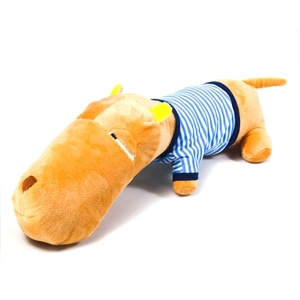

今天在新浪微博上看到一条关于考研的 [微博](http://weibo.com/1813080181/z9HJ2hTOy)（注：链接已失效。当年的薛蛮子可以了解一下），不免想起自己当初为什么选择放弃考研。

其实在我刚毕业的那两年还是有考研的想法的，骨子里一直认为学习和上学是划等号的。在我工作了两年多以后，这种想法不是很强烈了，不过潜意识里还是认为上学才是真正的学习，工作的这两年期间在软件方面也在不断的尝试对哪个方向更有兴趣，其实这个问题一直都没有想太明白，直到今年才有了一个比较靠谱的想法，:)。

恰巧那段时间有两个不错的朋友来北京读研，平时也会去和他们聊一些自己的想法。其实我读研的原因很简单，希望到一个安静的没人打扰的地方对自己感兴趣的方向进行深入研究学习，为以后打基础，反正我也不想当科研人员，或者留在大学以后当教师，觉得计算机属于工科类，进入社会可能能发挥更大的价值吧。不过，当我看到他们的读研状态之后我有点犹豫了（别误会，他们的学校还是不错的，其中有一位朋友的学校还是挺牛b的），不过我还是觉得可能是个别现象，当我把自己想法跟其中一位朋友说了之后，他跟我说现在国内基本不可能有这样的地方。

那段时间无聊的时候我也会在网上搜索一些考生对学校的评价，想看看哪个学校的环境能和我的想法更拟合。后来无意间发现云风写过一篇关于读研的[文章](http://blog.codingnow.com/2006/01/oeouanoaoeea.html)，看完之后读研的念头基本上我就放弃了，后来某一天我突然转过这个弯儿了（我悟性一直很差，见谅！:D），想学习为什么非要读研呢？

后来不断反思的时候才意识到，其实当初非常想考研还有一个不正常的心态在起作用，那就是虚荣心，而不只是单纯的为了求学。

后来我才渐渐意识到身边的很多同学多多少少都有这个心态，只不过有的同学心知肚明但不敢面对，而有的同学一直都没有意识到，一直到今天。当然了还有的同学虽然嘴上说是为了找份好工作，其实是不敢面对现实，不敢迈入社会，心里上放不下这份学校的“荣誉”。

其实有些事情躲是躲不过的，如果你一直不敢转过身去面对，你就永远没有战胜它的机会。或许你会被这个阴影困扰很久，而且时间越久，你战胜它的成本就越高，也许有一天你会彻底妥协，从学生时代的充满希望，被它变成不得不充满“希望”，这个时候剩下的，我想更多的会是无奈。

现在我自己对于这个问题的理解，应该是更理性了吧。而且对于当初放弃考研的这个决定至少到目前还没有感到后悔。随着时间的推移，我还逐渐意识到，学习真的是一辈子的事情，从学校学到的应该是找到适合自己学习的学习方法，而不仅仅是具体的知识。学校里的很多知识在社会中很快就有可能会被淘汰，我想很多朋友都明白这个道理，但是当初能意识到这一点的人，其实并不多，包括我自己也没有意识到。

说了这么多，主要还是想给自己做一些总结吧，起因可能还是那条微博。我觉得对自己多做总结是一个挺好的习惯，有很多事情当时其实是无意识就做了，过后想一想当初为什么这么做，为什么不那么做，有的时候会有意想不到的经验被发掘出来。话说回来，其实我挺理解那些学生的，但是又觉得挺遗憾的。呵呵，说了这么多，还是先管好自己再说吧。

另外，近段时间我发现一个很有趣的现象。我发现很多人在讨论两个或多个事物的时候思维总喜欢一维化，也就是说总喜欢给排个队，一定要分出个1、2、3来，而且很多人的这种思维方式不约而同的相似。完全没有逻辑的两个事物也是如此，比如说本来两种动物，A动物吃肉，B动物吃草，结论一定要是A吃肉比B吃草好，或者反过来，反正结果总是要比出个1、2、3来才行，要不总是心有不甘。当然了，争论一定是要有多个人才能形成，所以带有这种思维方式的人占大多数，而且不分地域，网上争论多半不是一个地方的嘛，我觉得这个现象蛮好玩的。

后来无聊的时候想了想，可能和我们的多年的教育有很大关系，上学的时候不是排名就是排名，凡事都要排出个1、2、3来，你想啊，除了学习排名以外，开运动会排名，大扫除排名，捐个款也要排名，各自的爹也要给排名，包括后来的升学，也要排名，进入社会不免就会产生一种思维惯性，就是凡事都要排个名，包括收入，职位高低，学历高低，甚至好玩的是朋友之间各自交往的朋友圈子也要拿过来排个名，比如你认识A，我认识B，我可能会潜意识里夸B多么多么牛b，以示B比A其实牛b。呵呵，是不是觉得蛮好玩的。不知道你身边有没有这样的现象，反正我是见过的，网上或现实生活都有见过，呵呵。

哦，还有最后一件事，这个礼拜本来想买一个靠垫儿来着，后来在淘宝上发现大头狗公仔不错，结果就买了一只，我还给他起了个名儿，叫“木桶”，形象吧，哈哈～！

